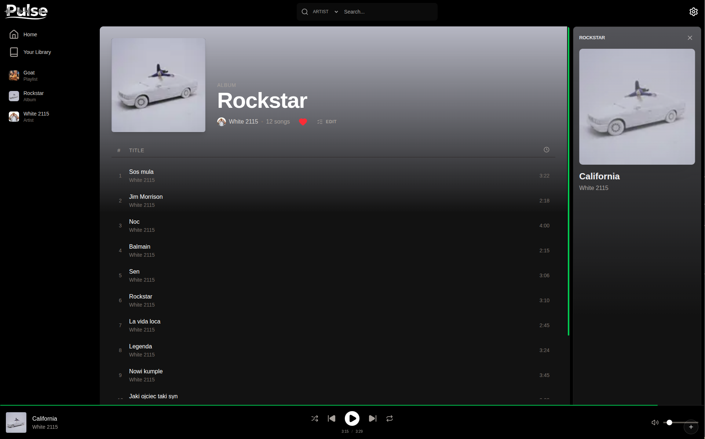
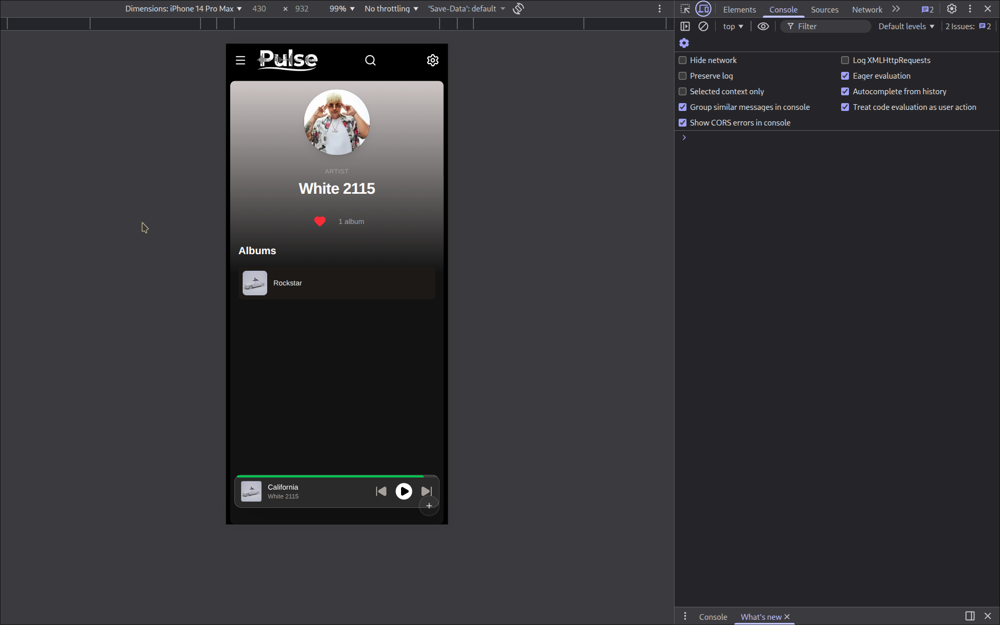
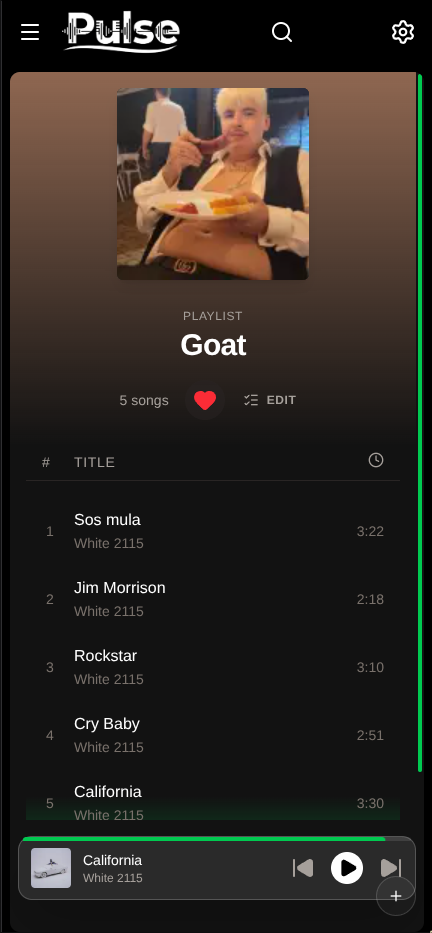

# Pulse

Pulse is a music streaming web application for managing and playing your personal music collection. It provides a simple interface to browse albums, artists, and playlists with smooth transitions.

## Tech Stack

- **Shadcn/ui**: Component library for the user interface.
- **AWS Amplify / GraphQL**: Backend integration and data fetching.
- **Zustand**: Simple state management for the player and app settings.
- **Framer Motion**: Used for layout animations and smooth transitions.

## Infrastructure

The backend is managed with AWS CDK and is hosted in a separate [repository](https://github.com/your-username/pulse-backend).

## Setup

1. Clone the repository.
2. Install dependencies with `npm install`.
3. Run the development server with `npm run dev`.